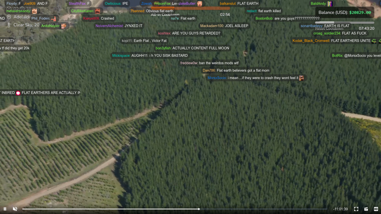

# Kick.com Fullscreen Chat Overlay

Enhance your Kick.com viewing experience with a dynamic fullscreen chat overlay. Messages flow seamlessly from right to left, providing an immersive chat environment while you enjoy your content. This script works in both live and VOD (Video on Demand) modes.

## Features

- Fullscreen chat overlay for Kick.com
- Elegant left-to-right message transition
- Compatible with both live and VOD (Video on Demand) modes
- Experimental: May result in performance issues or lag

## Instructions

1. Install a user script manager like [Violentmonkey](https://violentmonkey.github.io/get-it/).
2. Install this script by visiting [Greasy Fork](https://greasyfork.org/en/scripts/476381-kick-com-fullscreen-chat-overlay).
3. Enjoy Kick.com with an enhanced chat experience!

## Now Available on Firefox!

